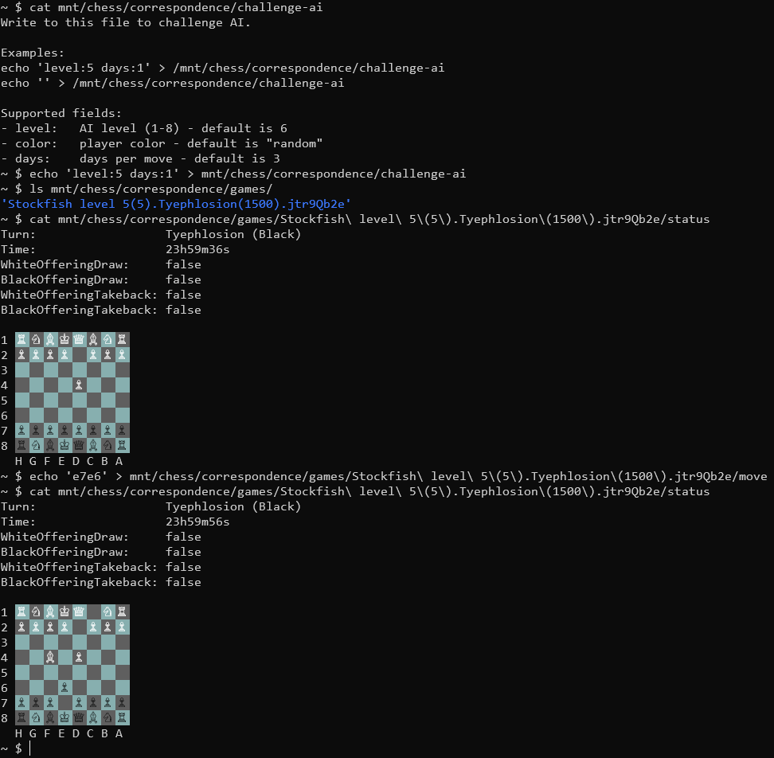

# chessfs

A FUSE filesystem that exposes your Lichess correspondence games as normal files and directories on your local machine.

## Running

1. Create a Lichess API access token (See https://lichess.org/account/oauth/token).
2. Export the required environment variable:

```bash
export CHESSFS_LICHESS_ACCESS_TOKEN="your-token-here"
```

3. Create a mount directory:

```bash
mkdir -p /mnt/chess
```

4. Start the filesystem:

```bash
chessfs /mnt/chess
```

To see the Lichess API requests and the underlying FUSE calls, enable debug mode:

```bash
chessfs -debug /mnt/chess
```

<details>
  <summary>Demo Screenshot</summary>

  
</details>

## Filesystem

The mounted tree looks like this:

```text
<mountpoint>/
├── correspondence/
│   ├── games/
│   │   ├── <white>(<rating>).<black>(<rating>).<game-id>/
│   │   │   ├── move
│   │   │   ├── resign
│   │   │   ├── draw
│   │   │   ├── takeback
│   │   │   ├── abort
│   │   │   ├── claim-victory
│   │   │   ├── claim-draw
│   │   │   └── status
│   │   └── ...
│   ├── results/
│   │   ├── <white>(<rating>).<black>(<rating>).<game-id>
│   │   └── ...
│   ├── challenge-random
│   ├── challenge-ai
│   └── ...
└── ...
```

- `correspondence/games/` lists active correspondence games you are currently playing.
- Each live game directory contains action files and a `status` file.
- `challenge-random` and `challenge-ai` are writable action files used to start a new game.
- `results/` lists recent finished correspondence games with PGN files.
- Read action files for instructions on how to write to it.
- Read the `status` file for the current position, turn, etc.

## Required environment variable

### CHESSFS_LICHESS_ACCESS_TOKEN

This is required.

It should contain a valid Lichess personal access token used to authenticate requests to the Lichess API.

Example:

```bash
export CHESSFS_LICHESS_ACCESS_TOKEN="xxxxxxxxxxxxxxxx"
```

You can generate a token in your Lichess account settings, then export it in your shell before starting `chessfs`.

## Other environment variables and defaults

These variables are optional and have defaults if omitted.

### CHESSFS_MAX_FINISHED_CORRESPONDENCE_GAMES

Controls how many finished correspondence games appear under `correspondence/results`.

- Default: `10`
- Example:

```bash
export CHESSFS_MAX_FINISHED_CORRESPONDENCE_GAMES=25
```

### CHESSFS_BOARD_STYLE

Controls how the board is rendered in the `status` file.

- Default: `styled`
- Valid values:
  - `styled`
  - `text`

Example:

```bash
export CHESSFS_BOARD_STYLE=text
```

### CHESSFS_LIGHT_SQUARE_HEX

Sets the color used for light squares in the styled board.

- Default: `#9AAABD`
- Accepts a hex value with or without the leading `#`

Example:

```bash
export CHESSFS_LIGHT_SQUARE_HEX=F0F8FF
```

### CHESSFS_DARK_SQUARE_HEX

Sets the color used for dark squares in the styled board.

- Default: `#4D5D70`
- Accepts a hex value with or without the leading `#`

Example:

```bash
export CHESSFS_DARK_SQUARE_HEX=2F4F4F
```

### CHESSFS_DARK_MODE

Turns on or off the dark-theme styling used by the board display in text mode.

- Default: `true`
- Accepts boolean values like `true` or `false`

Example:

```bash
export CHESSFS_DARK_MODE=false
```

## Rate limiting

If Lichess responds with `429 Too Many Requests`, `chessfs` waits 60 seconds and tries the request again. If the same error happens again, it returns an error.
